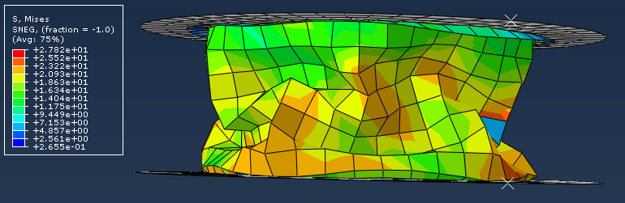
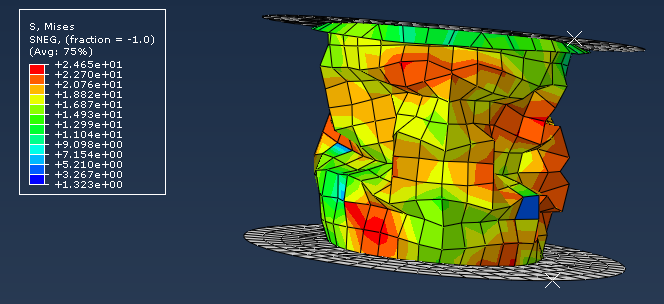

# 🧱 RCV de pots de yaourt sous Abaqus 

Projet réalisé dans le cadre du cours Ateliers logiciels scientifique à l'Université de Reims. Ce cours est une composante du Master 2 Mathématiques et Apllications parours Calcul Scientifique.

## 🎯 Objectif

Étudier et comparer la résistance à la compression verticale (RCV) de deux pots de yaourt aux géométries différentes, en simulant leur comportement mécanique entre deux plaques rigides dans le logiciel Abaqus.

    <a href="https://github.com/kayivi/RCV_pots_yaourt/blob/main/figures/pots.png">

      
---

## ⚙️ Méthodologie

- Modélisation 3D des pots et des plaques de compression (parties rigides).
- Définition des propriétés matériaux du PS-choc : module d’Young, coefficient
de Poisson, courbe de plasticité non linéaire.
- Création de sections de différentes épaisseurs selon les zones du pot (rebord, contour, fond).
- Mise en place des interactions (contact, frottement), conditions aux limites (encastrement, vitesse imposée), et stockage de l’historique des forces verticales.
- Réalisation de deux simulations pour chaque pot : maillage grossier (5 mm) et raffiné (2 mm).
- Exploitation des résultats : contraintes de von Mises, déplacements, évolution de la force de compression.

---

## 📁 Organisation du dépôt

- [`src/`](https://github.com/kayivi/RCV_pots_yaourt/tree/main/src) : job Abaqus des 2 pots
- [`results/`](https://github.com/kayivi/RCV_pots_yaourt/tree/main/results) : résultats numérique
- [`figures/`](https://github.com/kayivi/RCV_pots_yaourt/tree/main/figures) : images clés du projet (pots et plaque + maillages)
- [`docs/`](https://github.com/kayivi/RCV_pots_yaourt/tree/main/docs) : compte rendu du projet

---

## 📷 Résultats

Les simulations ont permis d’observer les effets de la géométrie sur la rigidité globale. Les forces maximales de compression varient selon le maillage et le design du pot. Le modèle permet d’identifier des zones critiques de déformation, et de comparer efficacement la RCV entre les deux formes.

| Pot 1 | Pot 2 |
|---------------------------|-------------------|
|   |  |

---

## 🔧 Outils

`Abaqus` — Éléments finis, Modélisation 3D, Plasticité, Post-traitement graphique, Matériaux polymères
